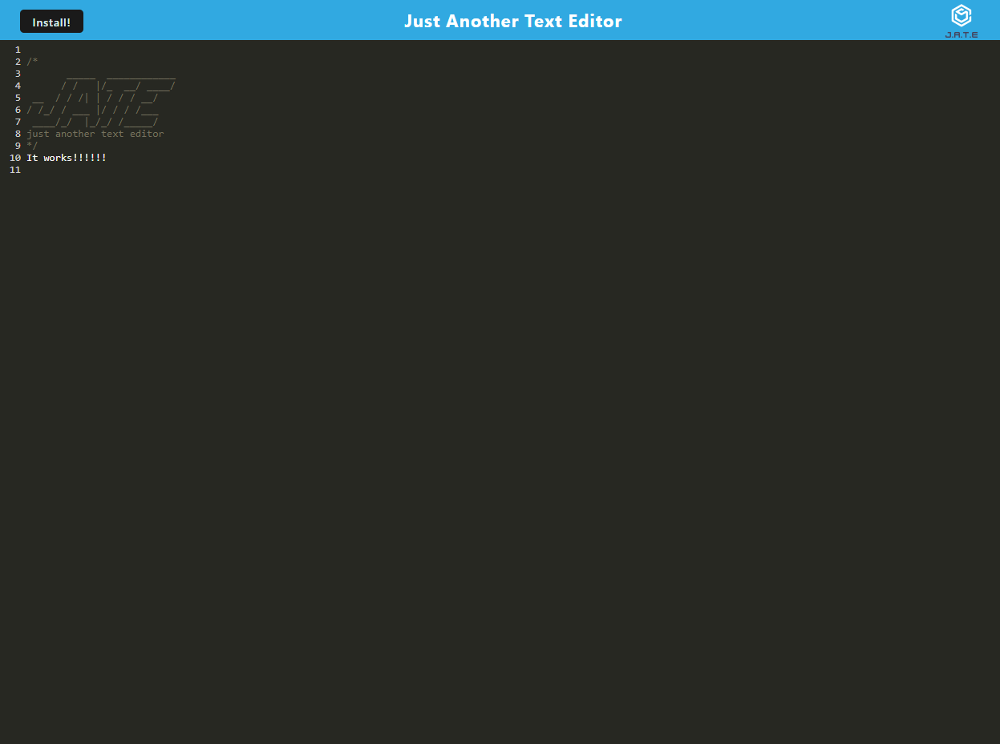

  # pwa-text-editor

  

  ## Table-of-Contents

  * [Description](#description)
  * [Installation](#installation)
  * [Usage](#usage)
  * [Screenshots](#screenshots)
  * [Credits](#credits)
  * [Tests](#tests)
  * [Questions](#questions)
  
  ## [Description](#table-of-contents)

  This is a challenge for the Georgia Tech Coding Bootcamp to use refactor starter code to produce a PWA application that presents itself as a text editor. This challenge demonstartes the ability to use PWAs to create an application and operate it without local connection. 

  I created this application for my class and to demonstrate my ability to use PWAs to create an operational application.

  Someone can use this application to see how PWAs can be used to create an offline application or to generally save text to a pleasing application.

  ## [Installation](#table-of-contents)

  In order to install this application, you can install it through installation of the code from my repository or through heroku. You can clone my code and operate it through NPM which will start the application. The page will give you an option to download to your local device. Heroku can do the same without cloning the code and just accessing the application outright.

  ## [Usage](#table-of-contents)

  Once downloaded, all you need to do is enter text into the editor and it will save automatically.

  ## [Screenshots](#table-of-contents)

  * 
  
  
  ## [Credits](#table-of-contents)

  This is a challenge for the Georgia Tect Coding Bootcamp. No contributions are needed.

  
  ## [License](#table-of-contents)

  This application is under the following license:

  [mit](https://choosealicense.com/licenses/mit)
    
  
  ## [Tests](#table-of-contents)

  No tests are required for this application.

  ## [Questions](#table-of-contents)

  Contact Information:

  GitHub: (https://github.com/AaronDreyer)

  Email: aaronottaway@gmail.com
